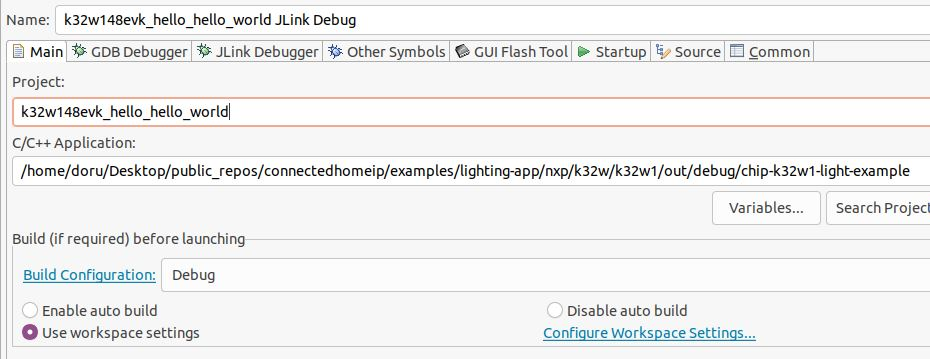

# NXP Application Code Hub
[](https://www.nxp.com)

## FRDM MCXW71 Matter light & switch app Thread end device solution


The <strong>Matter FRDM-MCXW71 Light Switch Combo example</strong> demonstrates a dual-endpoint application. <strong>Endpoint 1</strong> represents a <strong>Light Device (bulb)</strong>, while <strong>Endpoint 2</strong> functions as a <strong>Light Switch device</strong>. The light bulb is simulated using the onboard RGB LED, and buttons are used to test turning the local light bulb on/off or controlling bound lights. This example serves as a reference for developing your own Matter-based applications.<br /><br />This example is built on <strong>Matter</strong> and the <strong>NXP MCXW71 SDK</strong>, supporting remote access and control of a light bulb over a <strong>low-power, 802.15.4 Thread network</strong><br /><br />It operates as a <strong>Matter accessory</strong>, meaning it can be paired with an existing <strong>Matter network</strong> and controlled through that network.

[](images/frdm-mcxw71.jpg)

#### Boards: FRDM-MCXW71
#### Categories: Wireless Connectivity, RTOS
#### Peripherals: Bluetooth, WiFi, 802.15.4
#### Toolchains: GCC

## Table of Contents
1. [Software](#step1)
2. [Hardware](#step2)
3. [Setup](#step3)
4. [Results](#step4)
5. [Demo with NXP chip-tool APP](#step5) 
6. [Support](#step6)
7. [Release Notes](#step7)

## 1. Software<a name="step1"></a>
In order to build the Project CHIP example, we recommend using a <strong>Linux
distribution</strong>.

The build system has been tested on the following Operating Systems:
- macOS 10.15
- Debian 11 (64 bit required)
- Ubuntu 22.04 LTS
- Windows 10 (experimental)

### Build system features

The Matter build system has the following features:

-   Very fast and small footprint
-   Cross-platform handling: Linux, Darwin, Embedded Arm, among others
-   Multiple toolchains & cross toolchain dependencies
-   Integrates automated testing framework: `ninja check`
-   Introspection: `gn desc`
-   Automatic formatting: `gn format`


## 2. Hardware<a name="step2"></a>
The following boards are required:
- [FRDM-MCXW71](https://www.nxp.com/part/FRDM-MCXW71#/)


<a name="device-ui"></a>

## Device UI
[](images/frdm-mcxw71_deviceUI.jpg)

The example application provides a simple UI that depicts the state of the
device and offers basic user control. This UI is implemented via the
general-purpose LEDs and buttons built in the FRDM-MCXW71 board.

**LED_BLUE** shows the overall state of the device and its connectivity. Four
states are depicted:

-   _Short Flash On (50ms on/950ms off)_ &mdash; The device is in an
    unprovisioned (unpaired) state and is waiting for a commissioning
    application to connect.

*   _Rapid Even Flashing (100ms on/100ms off)_ &mdash; The device is in an
    unprovisioned state and a commissioning application is connected via BLE.

-   _Short Flash Off (950ms on/50ms off)_ &mdash; The device is full
    provisioned, but does not yet have full network (Thread) or service
    connectivity.

*   _Solid On_ &mdash; The device is fully provisioned and has full network and
    service connectivity.

NOTE:
    LED_BLUE will be disabled when CHIP_DEVICE_CONFIG_ENABLE_OTA_REQUESTOR is enabled (default is `disable`).
    On FRDM-MCXW71 board, PTC1 is wired to LED_BLUE also is wired to CS (Chip Select) 
    External Flash Memory. OTA image is stored in external memory because of it's size.
    If LED_BLUE is enabled then it will affect External Memory CS and OTA will not work.

**RGB LED** shows the state of the simulated light bulb. When the LED is lit the
light bulb is on; when not lit, the light bulb is off.

**Button SW2** can be used to start BLE advertising.
- A SHORT press</b> of the button  
will enable Bluetooth LE advertising for a predefined period of time. 
- A LONG Press</b>
Button SW2 initiates a factory reset. After an initial period of 3 seconds, LED_BLUE and RGB LED will flash in unison to signal the pending reset. After 6 seconds will cause the device to reset its persistent configuration and initiate a reboot. The reset action can be cancelled by press SW2 button at any point before the 6 second limit.

**Button SW4** can be used to toggle a binded light device or to change the state of the simulated light bulb. Short press toogles the light corresponded to remote light.


## 3. Setup<a name="step3"></a>
- Make sure that below prerequisites are correctly installed .
```
sudo apt-get install git gcc g++ pkg-config libssl-dev libdbus-1-dev \
libglib2.0-dev libavahi-client-dev ninja-build python3-venv python3-dev \
python3-pip unzip libgirepository1.0-dev libcairo2-dev libreadline-dev
```
-   Step 1: Clone Matter repo:
```
$ git clone -b v1.4.0.0 https://github.com/NXP/matter.git && pushd . && cd matter && scripts/checkout_submodules.py --shallow --platform nxp --recursive && source ./scripts/activate.sh && ./third_party/nxp/nxp_matter_support/scripts/update_nxp_sdk.py --platform common && popd
```
-   Step 2: Clone and overwrite the files
```
$ git clone https://github.com/nxp-appcodehub/ap-frdm-mcxw71-light-switch-combo-app.git && cp -r -f ap-frdm-mcxw71-light-switch-combo-app/examples matter/.
```

-   Step 3: Activate local environment 
```
$ cd matter
$ source ./scripts/activate.sh
```

-   Step 4: Build Matter with Border Router configuration with BLE commissioning (ble-wifi) 

```
$ cd examples/light-switch-combo-app/nxp/mcxw71
# Create the project
$ gn gen out/debug --args="nxp_enable_ot_cli=false is_debug=false chip_openthread_ftd=true chip_crypto=\"platform\""
$ ninja -C out/debug
```

In case that Openthread CLI is needed, `chip_with_ot_cli` build argument must be
set to 1.

After a successful build, the `elf` and `srec` files are found in `out/debug/` - `see the files prefixed with chip-mcxw71-light-switch-combo-example`.

## Manufacturing data

Use `chip_with_factory_data=1` in the gn build command to enable factory data.

For a full guide on manufacturing flow, please see
[Guide for writing manufacturing data on NXP devices](https://github.com/NXP/matter/blob/v1.4.0-pvw1/docs/guides/nxp/nxp_manufacturing_flow.md).


## 4. Flashing and debugging<a name="step4"></a>

Please install <b>MCU-Link tool</b> first to enable debugging and programming functions for the FRDM-MCXW71 development platform.

This process requires flashing two images onto the board : one for the <b>NBU</b> (CM3)  and one for the <b>host</b> (CM33).

The image needed on the host side is the one generated in `out/debug/` while the one needed on the NBU side can be found in the downloaded [NXP-SDK](https://mcuxpresso.nxp.com/) package at path -	
```
middleware\wireless\ieee-802.15.4\bin\k32w1\k32w1_mcxw71_nbu_ble_15_4_dyn_matter.sb3
```


- !!! Only when you get a new board , do we need to <b>install driver</b> once.
- !!! And only when a new SDK is released , we need to <b>flash NBU image</b> again.

### 4.1 Installing driver

1. Go to the [MCU-Link](https://www.nxp.com/design/design-center/software/software-library/mcu-link-pro-debug-probe:MCU-LINK-PRO) page on the NXP website
2. Click <b>Design Resources</b>. Then, click the <b>SOFTWARE</b> category. The latest installation packages for all three supported OSs will be displayed at the top.
3. Download the package for your host OS and install it (Linux/MacOS) or execute the installer program (Windows). The package is installed/unzipped to the MCU-LINK_installer_Vx_xxx directory
4. Add jumper to `JP5`
5. Plug MCXW71 to the USB port
6. To install J-Link firmware, open a command prompt and call the program script:   
`
<Install Dir>\scripts\program_JLINK
`
7. Remove jumper from JP5 and reboot device


### 4.2 Flashing the NBU image
<b>Tip:</b> It is necessary to work with the matching NBU image for the SDK version of the application you are working with. This means that when you download your SDK, prior to loading any wireless SDK example, update your NBU image with the provided binaries in the following folder of the SDK
1. Go to the [MCUXpresso SDK website](mcuxpresso.nxp.com). Click on <b>Select Development Board</b> to search for the evaluation board.
2. In the Search for Hardware search box, type in the selected board <b>FRDM-MCXW71</b>. 
3. Make sure select the lastest SDK version <b>(2.16.100+)</b>. Click on the board to select it.
4. On the right hand side you will see the option to build the SDK for the FRDM-MCXW71. Click on this button to add the middleware needed.
5. To build the SDK, let’s <b>Select All</b> for the middleware available. Then scroll down and press <b>Download SDK</b>. 
6. Once downloaded, drag and drop to the <b>Installed SDKs</b> window in the MCUXpresso IDE.
7. Locate the <b>sb3 image file</b> in the SDK package:<br> 
   `middleware\wireless\ieee-802.15.4\bin\mcxw71\mcxw71_nbu_ble_15_4_dyn_matter_1_0_17_2.sb3`
8. Copy the sb3 file into the bin folder of the MCU-Link installation directory- <br>
     `<MCU-Link Install Dir>\bin\`
9.  Keep the SW3(ISP) button on the board pressed ,while connecting the board to the host computer USB port
10. Use the <b>blhost tool</b> to flash the NBU image, open a command prompt and call the program script:<br>
`Windows users: Check the COM port number in Device Manager before running the command.`
```
    cd <MCU-Link Install Dir>\bin\
    blhost.exe -p COM27,115200 receive-sb-file <sb3 file>
```

<a name="flashing-the-host-image"></a>

### 4.3 Flashing the host image

Host image is the one found under `out/debug/`. It should be written after each build process. 

1. Download  [JLink](https://www.segger.com/downloads/jlink/) tool
2. Plug MCXW71 to the USB port 

3. Create a new file, `commands_script`, with the following content (change application name accordingly):

```bash
reset
halt
loadfile chip-mcxw71-light-switch-combo-example.srec
reset
go
quit
```

4. copy the application and `commands_script` in the same folder that JLink executable is placed. Execute:

```bash
$  jlink -device MCXW71 -if SWD -speed 4000 -autoconnect 1 -CommanderScript commands_script
```

<a name="debugging"></a>

### 4.5 Debugging

One option for debugging would be to use MCUXpresso IDE.

- Drag-and-drop the zip file containing the NXP SDK in the "Installed SDKs" tab:


- Import any demo application from the installed SDK:

```
Import SDK example(s).. -> choose a demo app (demo_apps -> hello_world) -> Finish
```


- Flash the previously imported demo application on the board:

```
Right click on the application (from Project Explorer) -> Debug as -> JLink/CMSIS-DAP
```

After this step, a debug configuration specific for the MCXW71 board was created. This debug configuration will
be used later on for debugging the application resulted after ot-nxp compilation.

- Import Matter repo in MCUXpresso IDE as Makefile Project. Use _none_ as
  _Toolchain for Indexer Settings_:

```
File -> Import -> C/C++ -> Existing Code as Makefile Project
```


- Replace the path of the existing demo application with the path of the MCXW71 application:

```
Run -> Debug Configurations... -> C/C++ Application
```



## 5. Demo with NXP chip-tool APP<a name="step5"></a>

This chapter provides a demo tutorial on how to use the FRDM-RW612 with NXP’s Chip-Tool app for pairing and basic control operations. 

For more detailed information, please refer to the following link: <br>
[UG10178 Quick Start to the Matter Demo NXP CHIP Tool app, FRDM-RW612 and FRDMMCU W71 ](https://www.nxp.com/docs/en/user-guide/UG10178.pdf)


### 5.1 Install APK 
- Using the Android phone, go to the [Google Play Store](https://play.google.com/store)

- Search “NXP Matter Chip-tool”

[](images/install_apk.png)


### 5.2 Wi-Fi Prerequisites
Configure the AP as shown below.
- If the AP supports the IPv6 DHCP server, it must be `disabled`.
- WPA3 is not supported in the Matter demo binary for RW612. The AP must be configured in `WPA2 mode`.

Connect your android phone to the Access Point first .The Android phone and RW612-FRDM must be connected to an Access Point and able to reach each other via its IPv6 address.

### 5.3  OTBR Prerequisites
If we want to add thread device to the Matter chip-tool for control, an additional OTBR is required to support network connectivity.In this guide, we use the FRDM-RW612 light-switch-combo-example app as the OTBR.
For detailed instructions on adding the FRDM-RW612 to the chip-tool app, please refer to the following link: [FRDM RW612 Matter light & switch app plus Thread Border Router solution](https://github.com/nxp-appcodehub/ap-frdm-rw612-light-switch-otbr-combo#step6).

When the FRDM-RW612 firmware startup, the OTBR will be automatically brought up.
<br>Get the OTBR table list as shown in the following example:
```
>otcli dataset active
Active Timestamp: 1
Channel: 17
Channel Mask: 0x07fff800
Ext PAN ID: 1111111122222222
Mesh Local Prefix: fdca:a943:242e:b986::/64
Network Key: 00112233445566778899aabbccddeeff
Network Name: OpenThread-b04c
PAN ID: 0x1234
PSKc: 8d4874b9ac7e0ad605179fc71af9a1c8
Security Policy: 672 onrc 0
Done
```
Please remember the `Network Name` and the `PSKc` ,as these parameters will be used for commissioning the FRDM-MCXW71. 

### 5.4 Commissioning FRDM-MCXW71
Make sure your phone to connect to the correct <b>AP</b> and turn on <b>Bluetooth</b>. 

Step1 . Open the Chip-tool app and tap Pair New Device (Thread Device).

Step2 . Enter the discriminator and PIN code (default values: 3840 and 20202021, respectively).

Step3 . Select OTBR (Open Thread Border Router) network information on the Android tool: select your `Network Name` and the correct key type `PSKc`, enter the `psck key value`.
[](images/selectOTBR.png)

Step4 .Wait for the new prompt screen to appear, then <b>press the SW2 button on the W71 board to start Bluetooth LE advertising</b>. After that, press the NEXT button.<br>
`Note : That OTBR discovery can take a few minutes with the status change. One to two minutes is normal`


[](images/OTBRparing.png)

Step5 . Once the device is successfully paired, you can control the switch.

[](images/w71_control.png)


## 6. Support<a name="step6"></a>
Related more information about FRDM-MCXW71 can check [here](https://github.com/NXP/matter/tree/v1.4.0-pvw1/examples/light-switch-combo-app/nxp/mcxw71).

[UG10178](https://www.nxp.com/docs/en/user-guide/UG10178.pdf) Quick Start to the Matter Demo NXP CHIP Tool app, FRDM-RW612 and FRDMMCU W71 

#### Project Metadata

<!----- Boards ----->
[]()

<!----- Categories ----->
[](https://mcuxpresso.nxp.com/appcodehub?category=wireless_connectivity)
[](https://mcuxpresso.nxp.com/appcodehub?category=rtos)

<!----- Peripherals ----->
[](https://mcuxpresso.nxp.com/appcodehub?peripheral=bluetooth)
[](https://mcuxpresso.nxp.com/appcodehub?peripheral=wifi)
[](https://mcuxpresso.nxp.com/appcodehub?peripheral=802154)

<!----- Toolchains ----->
[](https://mcuxpresso.nxp.com/appcodehub?toolchain=gcc)

Questions regarding the content/correctness of this example can be entered as Issues within this GitHub repository.

>**Warning**: For more general technical questions regarding NXP Microcontrollers and the difference in expected functionality, enter your questions on the [NXP Community Forum](https://community.nxp.com/)

[](https://www.youtube.com/NXP_Semiconductors)
[](https://www.linkedin.com/company/nxp-semiconductors)
[](https://www.facebook.com/nxpsemi/)
[](https://x.com/NXP)

## 7. Release Notes<a name="step7"></a>
| Version | Description / Update                           | Date                        |
|:-------:|------------------------------------------------|----------------------------:|
| 1.0     | Initial release on Application Code Hub        | February 20<sup>th</sup> 2025 |

<small>
<b>Trademarks and Service Marks</b>: There are a number of proprietary logos, service marks, trademarks, slogans and product designations ("Marks") found on this Site. By making the Marks available on this Site, NXP is not granting you a license to use them in any fashion. Access to this Site does not confer upon you any license to the Marks under any of NXP or any third party's intellectual property rights. While NXP encourages others to link to our URL, no NXP trademark or service mark may be used as a hyperlink without NXP’s prior written permission. The following Marks are the property of NXP. This list is not comprehensive; the absence of a Mark from the list does not constitute a waiver of intellectual property rights established by NXP in a Mark.
</small>
<br>
<small>
NXP, the NXP logo, NXP SECURE CONNECTIONS FOR A SMARTER WORLD, Airfast, Altivec, ByLink, CodeWarrior, ColdFire, ColdFire+, CoolFlux, CoolFlux DSP, DESFire, EdgeLock, EdgeScale, EdgeVerse, elQ, Embrace, Freescale, GreenChip, HITAG, ICODE and I-CODE, Immersiv3D, I2C-bus logo , JCOP, Kinetis, Layerscape, MagniV, Mantis, MCCI, MIFARE, MIFARE Classic, MIFARE FleX, MIFARE4Mobile, MIFARE Plus, MIFARE Ultralight, MiGLO, MOBILEGT, NTAG, PEG, Plus X, POR, PowerQUICC, Processor Expert, QorIQ, QorIQ Qonverge, RoadLink wordmark and logo, SafeAssure, SafeAssure logo , SmartLX, SmartMX, StarCore, Symphony, Tower, TriMedia, Trimension, UCODE, VortiQa, Vybrid are trademarks of NXP B.V. All other product or service names are the property of their respective owners. © 2021 NXP B.V.
</small>

